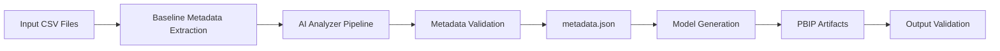

# Power BI Pipeline SLA Tracker Template

A ready-to-use Power BI template for tracking pipeline/process SLA compliance, featuring a custom **floating bar chart** technique (built with a disconnected `GENERATESERIES` spacing table) to visualize start-to-end duration against SLA targets at a glance.

<!-- TODO: add assets/preview.png before publishing -- image is currently referenced but missing -->

---

## What's Included

| File | Description |
|---|---|
| `data/Fact_Pipeline_SampleData.csv` | Sample fact table — swap with your own pipeline/process data |
| `data/Dim_Category.csv` | Category dimension table |
| `src/measures.dax` | All DAX measures used in the report |
| `PipelineTheme.json` | Custom Power BI theme (green/red SLA compliance palette) |
| `Pipeline_SLA_Tracker_Build_Guide.md` | Full step-by-step build guide — data model, DAX, floating bar chart setup, report layout |

---

## Repository Structure


powerbi-pipeline-sla-template
│
├── data/
│ ├── Fact_Pipeline_SampleData.csv
│ └── Dim_Category.csv
│
├── model/
│ └── TMDL semantic model definitions
│
├── pbip/
│ └── Power BI Project artifacts
│
├── powerquery/
│ └── Data transformation scripts
│
├── src/
│ └── DAX measures and supporting logic
│
├── scripts/
│ └── Metadata generation and automation tools
│
├── metadata/
│ └── Generated metadata contracts
│
├── build/
│ ├── validate.ps1
│ ├── build.ps1
│ └── publish.ps1
│
└── docs/
├── Architecture
├── Getting-Started
├── UserGuide
├── Developer Guide
├── Testing
└── Configuration

---

## Features

### Reporting & Visualization

- **SLA Compliance %** tracking with card visuals
- **Floating bar chart** — visualizes each pipeline's actual start/end window against its SLA target
- **Conditional formatting** — bars turn red on SLA breach, green on compliance
- **Breach Log page** — sortable table + category heatmap of breach rates
- Category slicer for quick filtering

### AI & Automation (Phase 4)

- **AI-Assisted Metadata Generator** — automatically extracts, analyzes, and enriches semantic metadata from datasets using deterministic analyzers.
- **Metadata Contract Generation** — produces a standardized `metadata.json` schema used by downstream model and report generation.
- **Semantic Inference Engine** — identifies candidate keys, measures, relationships, formatting hints, and semantic roles.
- **Metadata Quality Validation** — detects schema issues, missing relationships, and modeling risks before PBIP generation.
- **CI/CD Integration** — executes metadata generation and validation as part of the automated build pipeline.

## 📚 Documentation

| Document | Description |
|----------|-------------|
| [Getting Started](docs/getting-started.md) | Installation, setup, and first build |
| [Architecture](docs/architecture.md) | Solution architecture and AI metadata workflow |
| [Developer Guide](docs/DeveloperGuide.md) | AI module architecture, extensibility, and coding guidelines |
| [Metadata Schema](docs/MetadataSchema.md) | Metadata object model, JSON schema, and extension guidance |
| [User Guide](docs/UserGuide.md) | Using generated metadata and reports |
| [Configuration](docs/Configuration.md) | Project configuration, paths, and feature flags |
| [Testing](docs/Testing.md) | Validation, unit tests, integration tests, and regression testing |
| [Changelog](CHANGELOG.md) | Release history and version tracking |

## Setup

1. Clone this repo
2. Open **Power BI Desktop**
3. Get Data → Text/CSV → import both files from `/data`
4. Follow `Pipeline_SLA_Tracker_Build_Guide.md` for the relationship, DAX measures, and floating bar chart configuration
5. Apply the theme: **View → Themes → Browse for themes** → select `PipelineTheme.json`
6. Replace the sample data with your own pipeline data (see "Data Source Swap" section in the build guide)

## Requirements

- Power BI Desktop (latest version recommended)
- Basic familiarity with Power Query and DAX to customize for your data source

## Automated Build Pipeline

The project includes GitHub Actions automation for validation and artifact generation.

Pipeline stages:

1. Repository validation
2. CSV schema checks
3. Metadata generation
4. Semantic model validation
5. PBIP artifact generation
6. Build artifact packaging

Workflow files:

- `.github/workflows/validate.yml`
- `.github/workflows/build.yml`
- `.github/workflows/release.yml`

## License

Released under the MIT License.

Commercial resale of the template package, branding, documentation, or marketplace distribution requires separate authorization.

## Author

Built by Pavithra Radhakrishnan — Power BI Developer & BI Analyst.

## AI Features

- AI-assisted metadata inference for tables, columns, data types, and modeling hints
- Rule-aware enrichment that preserves deterministic build behavior
- Validation-first generation that surfaces schema risks before PBIP output
- Extensible analyzer pipeline for domain-specific heuristics

## AI Metadata Generator Overview

Phase 4 introduces an AI Metadata Generator layer that transforms raw dataset signals into structured metadata used by model and report generation. The generator augments inferred schema with semantic annotations (for example: key candidates, measure candidates, and display grouping hints) while keeping existing build outputs compatible.

## Phase 4 Feature List

- Multi-source metadata normalization into one metadata contract
- Analyzer pipeline with pluggable scoring and enrichment stages
- Confidence-aware metadata fields for downstream validation decisions
- Pre-build diagnostics for missing keys, weak relationships, and low-quality fields
- Snapshot-friendly output for regression testing and CI checks

## AI Build Process

1. Read source data definitions and sampled records.
2. Infer baseline metadata (types, nullability, cardinality hints).
3. Run AI analyzers to enrich relationships, measures, and semantic labels.
4. Validate enriched metadata and emit diagnostics.
5. Persist metadata.json for model/report generation.
6. Continue standard PBIP generation and artifact validation.

## Example metadata.json Output

```json
{
	"version": "1.0",
	"generatedAtUtc": "2026-08-07T00:00:00Z",
	"tables": [
		{
			"name": "Fact_Pipeline_SampleData",
			"kind": "fact",
			"columns": [
				{
					"name": "PipelineID",
					"dataType": "string",
					"nullable": false,
					"semanticRole": "identifier"
				},
				{
					"name": "DurationHours",
					"dataType": "decimal",
					"nullable": false,
					"semanticRole": "measure",
					"formatHint": "0.00"
				}
			]
		}
	],
	"relationships": [
		{
			"from": "Fact_Pipeline_SampleData.CategoryId",
			"to": "Dim_Category.CategoryId",
			"cardinality": "manyToOne",
			"confidence": 0.98
		}
	],
	"diagnostics": []
}
```

## AI Metadata Workflow


