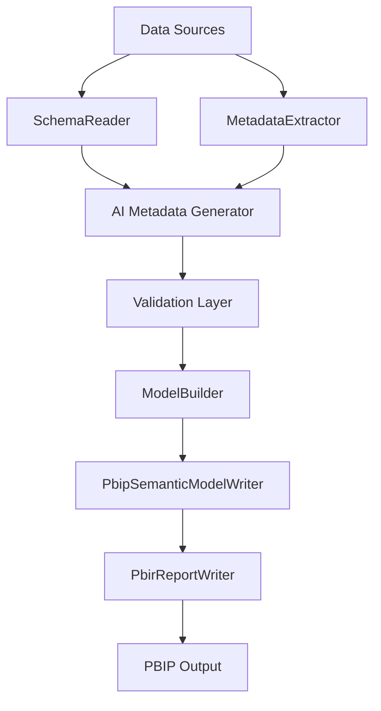

## Data Model

### Fact Table

Fact_Pipeline

Contains:

- Pipeline
- Workspace
- Start Time
- End Time
- Status
- Duration

### Dimension Tables

DimDate

DimWorkspace

DimPipeline

### Relationships

DimDate
    1 ───── *
Fact_Pipeline

DimWorkspace
    1 ───── *
Fact_Pipeline

DimPipeline
    1 ───── *
Fact_Pipeline

## Dashboard Layout

### Page 1

Pipeline Overview

Visuals

- KPI Cards
- SLA %
- Average Duration
- Success Rate

### Page 2

Pipeline Details

Visuals

- Table
- Matrix
- Filters

### Page 3

Failures

Visuals

- Failed Pipelines
- Error Counts
- Trend Chart

## Build Process

Build steps:

1. Validate folder structure
2. Validate required files
3. Validate Power Query exports
4. Validate semantic model
5. Produce build artifacts

## Deployment

Deployment Steps

1. Clone repository
2. Open Power BI project
3. Refresh data
4. Publish report
5. Configure scheduled refresh
6. Validate dashboard

## Screenshots

### Dashboard Overview

### Data Model

### Relationships

## AI Metadata Generator Architecture (Phase 4)

The AI Metadata Generator extends the existing ingestion-to-PBIP pipeline by inserting a metadata intelligence layer before model materialization. This layer is designed to be additive: it enriches metadata contracts without changing the existing orchestration boundaries.

Core responsibilities:

- Normalize source profiling into a common metadata object model.
- Apply analyzer stages for semantic inference (keys, measures, roles, and formatting hints).
- Emit deterministic metadata output suitable for CI snapshot validation.
- Produce diagnostics that are consumed by validation and build gates.

## Module Dependencies

## Metadata Generation Flow

1. Source data is profiled to detect table/column shape and data quality signals.
2. Baseline metadata is normalized to the shared contract.
3. AI analyzers enrich semantics (relationship candidates, measure candidates, role labels).
4. Validation rules score and gate enriched metadata.
5. Valid metadata is persisted and passed to model/report generation.

## AI Processing Pipeline

The processing pipeline should be implemented as ordered, composable stages:

- Stage 1: Structural inference (names, types, nullability, distinctness)
- Stage 2: Semantic enrichment (fact/dimension hints, key detection, KPI candidates)
- Stage 3: Relationship scoring and confidence assignment
- Stage 4: Consistency checks and diagnostics emission
- Stage 5: Final metadata projection for downstream generators

This stage model isolates responsibilities and supports targeted test coverage per stage.

## Future Extensibility

The architecture supports incremental extension without breaking current outputs:

- Add new analyzers by registering additional pipeline stages.
- Extend metadata schema via additive optional fields.
- Introduce domain-specific rule packs (for finance, operations, or IoT datasets).
- Add model-feedback loops where build-time validation can refine future metadata suggestions.