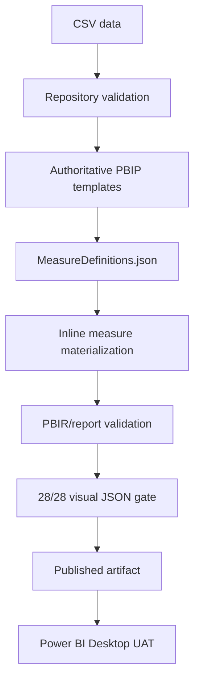

# Architecture — Version 1.0.0

## Overview

Version 1 is a template-first Power BI PBIP/PBIR pipeline. The checked-in report and semantic-model templates are authoritative; automation materializes the semantic model and validates the exact artifact that is released.

## Current stabilization status

The previously blocking PBIP/Desktop issues are closed:

- Required semantic-model template artifacts and platform metadata are restored.
- Artifact preparation preserves the report and semantic-model `.platform` files.
- Report materialization is template-first and uses the actual authoritative report template.
- The exact 28-visual inventory is preserved and enforced.
- Every published visual is parsed as JSON.
- Fake/empty report-extension materialization has been removed. A real extension definition is copied only if the authoritative template contains one.
- The former `ModelAuthoringHostService.UpdateModelExtensions` failure associated with the synthetic extension artifact is closed; current UAT loads the report and visuals.

The remaining validation issue is isolated to schema compatibility for the July 2026 Desktop `visualContainer/2.10.0` format. The authoritative template emits `visual.sortDefinition` and `visual.visualContainerObjects.columnHeaders`, but the analyzer currently treats them as additional properties. Compatibility must be added for exactly those two properties without weakening strict validation elsewhere.

## Flow

## Main components

- `data/` — sample source data.
- `pbip/` — authoritative PBIP report and semantic-model templates.
- `scripts/metadata/MeasureDefinitions.json` — measure source of truth.
- `scripts/tools/GenerateMetadata.ps1` — generates the Tabular Editor script.
- `scripts/GenerateMeasures.csx` — Tabular Editor 2.28-compatible derived script.
- `build/build.ps1` — template-first build and artifact gates.
- `build/Assert-VisualArtifactGate.ps1` — final published-artifact visual gate.

## Measure architecture

The measure contract is metadata-driven. The generated TE2.28 script is useful for manual materialization and inspection, while the automated repository build uses its own authoritative materialization step so CI is deterministic and does not require Tabular Editor.

Measures are written inline to `Fact_Pipeline_SampleData` in the generated semantic model. A generated `_Measures.tmdl` is intentionally not required.

## Report architecture

The Version 1 report contains:

- Home
- Executive Overview
- SLA Exceptions

The report template controls the visual set, layout, resources, and PBIR metadata. Automation must preserve that structure.

## Data path architecture

The model exposes a `DataFolder` expression. The fact partition consumes `File.Contents(DataFolder...)`. The build must keep this path portable so the PBIP can be consumed outside the CI runner.

## Validation boundaries

### Automated

- Data/schema validation.
- Measure contract validation.
- Semantic-model structure.
- Relationship validation.
- PBIR schema/version and dataset path.
- Exact 28 visual JSON inventory.
- JSON parsing and BOM checks.
- Final artifact gate.
- Explicit 2.10.0 compatibility for `sortDefinition` and `columnHeaders` once the analyzer compatibility layer is applied; all other additional properties remain rejected.

### Power BI Desktop

- KPI hierarchy rendering.
- Slicer interaction.
- Visual/page rendering.
- Registered resource/image display.

The second layer remains a separate acceptance boundary because static CI validation cannot reproduce the complete Power BI Desktop rendering/runtime experience.
